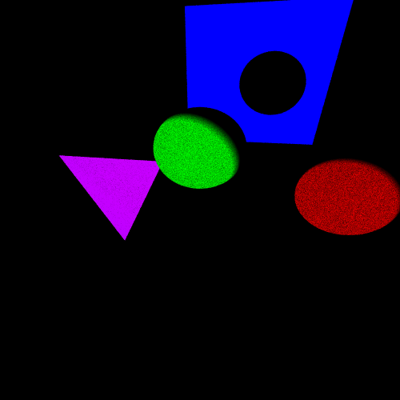

# raytracer
Ray tracer with object-oriented design. Exports images as .ppm file.



## Usage
"make" command compiles and creates an executable.
```sh
./raytracer.exe [scene-file] [anti-aliasing cycles (default=1)]
```

## Scene Template
[**tinyxml2**](https://github.com/leethomason/tinyxml2) is used for parsing.
```xml
<Scene>
    <maxraytracedepth>6</maxraytracedepth>
    <BackgroundColor>0 0 0</BackgroundColor>
    <Cameras>
        <Camera id="1">
            <Position>0 0 0</Position>
            <Gaze>0 0 -1</Gaze>
            <Up>0 1 0</Up>
            <NearPlane>-1 1 -1 1</NearPlane>
            <NearDistance>1</NearDistance>
            <ImageResolution>800 800</ImageResolution>
            <ImageName>simple.ppm</ImageName>
        </Camera>
    </Cameras>
    <Lights>
        <AmbientLight>25 25 25</AmbientLight>
        <PointLight id="1">
            <Position>0 0 0 </Position>
            <Intensity>1000 1000 1000</Intensity>
        </PointLight>
    </Lights>
    <Materials>
        <Material id="1">
            <AmbientReflectance>1 1 1</AmbientReflectance>
            <DiffuseReflectance>1 1 1</DiffuseReflectance>
            <SpecularReflectance>1 1 1</SpecularReflectance>
            <MirrorReflectance>0 0 0</MirrorReflectance>
            <PhongExponent>1</PhongExponent>
        </Material>
    </Materials>
    <VertexData>
    -0.5 0.5 -2
    -0.5 -0.5 -2
    0.5 -0.5 -2
    0.5 0.5 -2
    0.75 0.75 -2
    1 0.75 -2
    0.875 1 -2
    -0.875 1 -2
    </VertexData>
    <Objects>
        <Mesh id="1">
            <Material>1</Material>
            <Faces>
            3 1 2
            1 3 4
            </Faces>
        </Mesh>
        <Triangle id="1">
            <Material>1</Material>
            <Indices>
            5 6 7
            </Indices>
        </Triangle>
        <Sphere id="1">
            <Material>1</Material>
            <Center>8</Center>
            <Radius>0.3</Radius>
        </Sphere>
    </Objects>
</Scene>
```